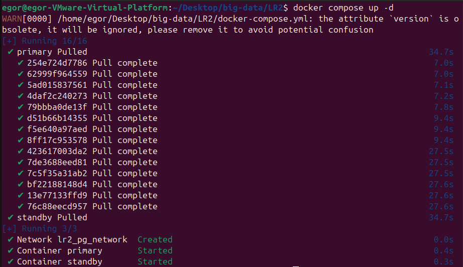
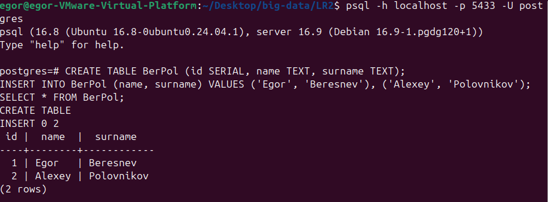
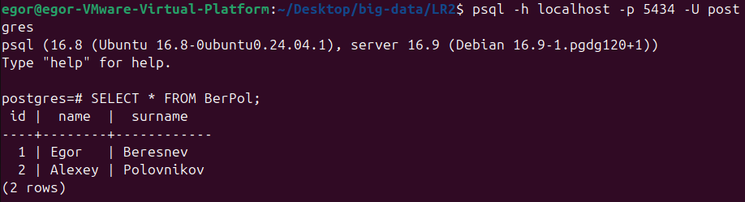
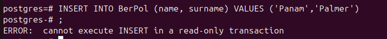
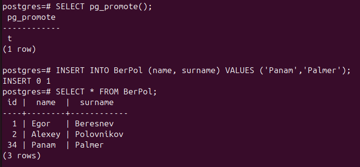

# Лабораторная работа 2

---

## Ход работы

Скрипт init.sh

```shell
# Ждем когда основная БД запуститься
until pg_isready -h my_primary -p 5432 -U postgres; do
  sleep 1
done

# чистим контейнер standby
rm -rf /var/lib/postgresql/data/*

# Копируем основную БД
PGPASSWORD=postgres pg_basebackup -h my_primary -D /var/lib/postgresql/data -U postgres -Fp -Xs -P -R

# Конфигурация для основной БД
echo "primary_conninfo = 'host=my_primary port=5432 user=postgres password=postgres'" >> /var/lib/postgresql/data/postgresql.auto.conf

# повышаем привилегии
chown -R postgres:postgres /var/lib/postgresql/data
chmod 700 /var/lib/postgresql/data

# Запускаем БД с нужными конфигами
su postgres -c 'postgres -c config_file=/etc/postgresql/postgresql.conf -c hba_file=/etc/postgresql/pg_hba.conf'
```

Собираем контейнеры



Добавляем данные



Подключаемся со второй бд, данные появились



Пытаемся добавить данные, ошибка из-за того режим read-only



Делаем из standby пишущую бд, работает


