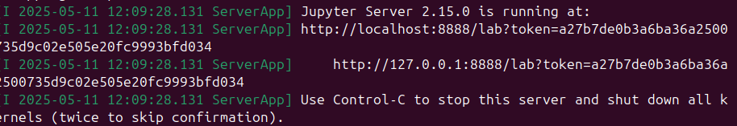
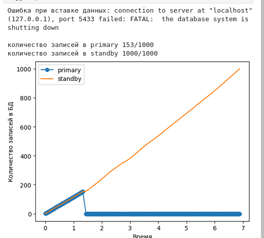
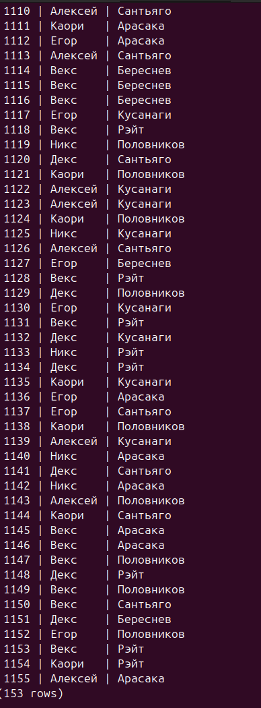
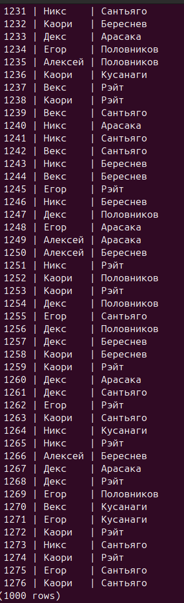

# Лабораторная работа 3
---
## Ход работы
Устанавливаем необходимые библиотеки python, для построения графиков и наглядного представления отказоустойчивости

psycopg2 для подключения к postgres

```shell
pip install psycopg2-binary
pip install matplotlib
pip install jupyter lab
```

Командой jupyter lab запускаем notebook с веб интерфейсом



В файле python находится код, который строит график по данным записанным в основную и резервную бд

Запускаем обе бд, запускаем скрипт, затем выключаем основную.
На графике видим как запросы с основной primary летят в standby, это происходит благодаря прокси.

График отказоустойчивости



Данные



